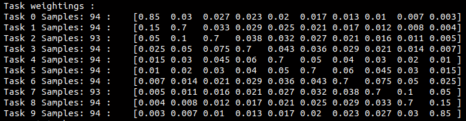

1. Gen initial model weight - as control across all testing - if done already -> skip
2. init_model - intialises and trains model
* Syllabus
  - Data: input, output
  - Weightings: 
  - Validation split: training data to be used for validation during training the  model (0.1)
  - Difficulty sorter: function to sort the data from easy to difficult
    - currently being done by length of sentences
  - Task count = count of training data splits 
